# Music market shifts during the pandemic

> **This is built on synthetic data.**

When lockdowns spread in March 2020, leadership needed a credible answer to a blunt question from press and partners: is the streaming market shrinking? I built a PR-ready analysis that pairs before-and-after period comparisons with a regression discontinuity in time, which pins each behavior change to the lockdown cutoff with autocorrelation-robust standard errors. The payoff is a defensible, well-communicated finding that listening did not fall but relocated, ready to steer public relations, release planning, and partner conversations.

**Live demo:** https://k1monfared.github.io/music_market_shifts/ , the interactive pandemic-listening dashboard you can open in a browser.

## Outputs

### 1. Did the audience shrink during lockdown, or did it just move?

It moved. Total daily streaming did not fall: it rose from 104.3 million plays per
day before lockdown to 111.7 million during lockdown, about +7.2%. What changed was
where people listened. Commute listening dropped from a 20.8% share of streams to
5.4% (−74%), and that attention moved into the home: focus and work listening rose
+51%, cooking and home rose +65%, and relaxation rose +9%.

How: the before-and-after comparison of period means. Total volume held while the
context shares reshuffled almost one for one.

So what: listening did not fall, it moved home. The audience adapted
rather than disappeared.

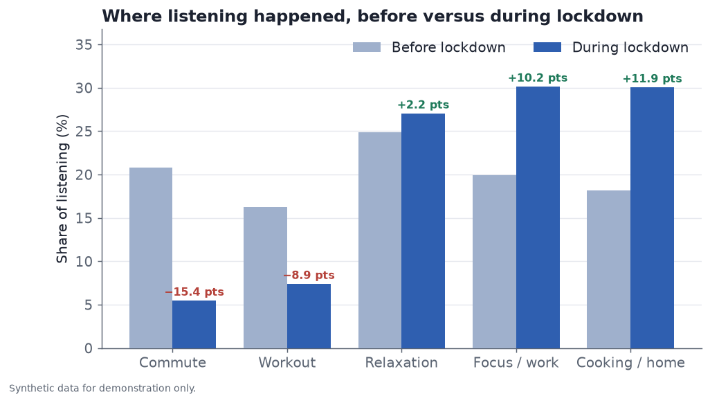

The share of listening by context, before versus during lockdown: commute and workout fall while focus, cooking, and relaxation rise.

### 2. A reporter asks how sure we are that lockdown caused this. What do we say?

We say the commute drop was a sharp break at the lockdown date, not a gradual
drift, and it held everywhere. The regression discontinuity in time estimates an
immediate level break of −14.0 percentage points of commute share at the March 11,
2020 cutoff (95% CI [−17.1, −10.8], p < 0.001), and the same commute decline
appears in all four regions studied (−43% in Latin America to −57% in Europe).

How: the regression-discontinuity-in-time estimate at the lockdown cutoff, backed
by a cross-region check.

So what: we can tie the shift to the lockdown week with confidence and state that
it is a broad behavior change, not a single-market quirk.

### 3. What did people actually listen to, and does it change our talking points?

Calmer and more familiar music. Average valence fell from 0.58 to 0.50 (an
immediate break of −0.075, p < 0.001) and tempo slowed from 118 to 110 BPM, while
the catalog share of streams climbed from 63.2% to 74.2% (a +10.1 point break,
p < 0.001).

How: the per-metric shifts before and after, with the discontinuity test confirming
the valence and catalog breaks at the cutoff.

So what: catalog and calm carried lockdown listening, a concrete talking point for
catalog value and release-timing conversations.

These answers come from three pieces: the before-and-after comparison of
pre-lockdown against lockdown period means, the regression-discontinuity-in-time
estimate that fixes each break to the March 11, 2020 cutoff, and the per-metric
shifts across context, device, mood, catalog, genre, and region. The sections below
document the data, the method, and every figure behind them.

---

## Contents

- [How to run](#how-to-run)
- [The business question](#the-business-question)
- [The approach](#the-approach)
- [Headline finding](#headline-finding)
- [Key findings](#key-findings)
- [Did the genre change?](#7-did-the-genre-change-ambient-and-classical-rose-dance-fell)
- [All regression discontinuity results](#all-regression-discontinuity-results)
- [Data dictionary](#data-dictionary)
- [Methods and limitations](#methods-and-limitations)
- [What a production version would add](#what-a-production-version-would-add)
- [Automating the change-point detection (future work)](#automating-the-change-point-detection-future-work)

## How to run

Interactive demo: `sh demo.sh` (serves the page on a free local port and opens your browser).

The repository ships with the data, report, figures, and findings already
committed, so you can read the results without running anything. To reproduce them
from scratch:

```bash
# 1. Create an isolated environment (FOSS only)
python -m venv .venv
source .venv/bin/activate
pip install -r requirements.txt

# 2. Reproduce everything: data -> analysis -> figures -> report
python scripts/run_demo.py
```

`run_demo.py` is the single entry point. It writes the synthetic CSVs to `data/`,
the findings to `outputs/findings.json`, the figures to `docs/images/`, and the
press report to `outputs/press_report.md`. Individual stages can also be run on
their own:

```bash
python scripts/generate_data.py     # regenerate data/ only
python scripts/generate_figures.py  # regenerate docs/images/ only
```

### interactive dashboard

`docs/index.html` is a small self-contained dashboard (Plotly via CDN) that reads
`docs/findings.json`. Because browsers block local file reads, serve the folder:

```bash
cd docs && python -m http.server 8000
# then open http://127.0.0.1:8000/index.html
```

## The business question

In March 2020, as lockdowns spread, press and partners asked a blunt question:
**is the music market shrinking?** Streaming is the core of the business, and a
credible, well-communicated answer had real stakes for public relations, release
planning, and partner confidence.

The job was not only to analyze the shift, but to publish it: a PR-ready findings
report that a communications team could stand behind and use to answer questions.

## The approach

1. **Model the market as a daily panel** across the dimensions that matter for the
   story: listening context (commute, workout, focus/work, relaxation,
   cooking/home), device (mobile, desktop, smart speaker, car), genre, musical
   mood (valence and tempo), catalog-vs-new-release mix, and region.
2. **Measure the shift two ways**, keeping the methods simple and defensible:
   - a **before/after comparison** of period means (pre-lockdown vs lockdown), and
   - a **regression discontinuity in time** (an interrupted time series) fitted at
     the lockdown cutoff, which estimates the immediate level break with
     autocorrelation-robust (Newey-West) standard errors. This mirrors the
     discontinuity-regression method used on the original project.
3. **Lead with communication**: a headline, six findings each backed by a chart,
   a "what to expect next" section, a cross-region robustness check, and a careful
   methods-and-limitations note.

## Headline finding

**Listening did not shrink during lockdown, it relocated.** Total streaming held
up (about +7% from the pre-lockdown baseline into lockdown, no collapse), while
*where*, *how*, and *what* people listened to changed sharply and abruptly.

---

## Key findings

### 1. The market held: total streaming did not fall

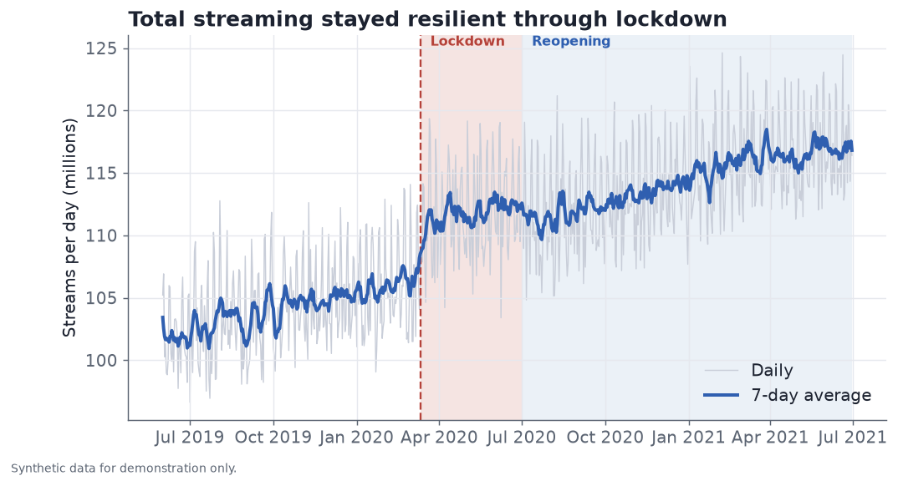

**Data behind this chart.** Total streams per day in millions. The faint line is
the raw daily value from the `total_streams_millions` field, and the bold line is
its 7-day centered rolling average. In a real setting this is the daily count of
completed plays across the catalog, taken from streaming and distribution
consumption logs.

### 2. Listening relocated from the commute and the gym to the home

Commute listening fell about 74% and workout about 55% as a share of streaming,
while focus/work (+51%), cooking/home (+65%), and relaxation (+9%) absorbed it.

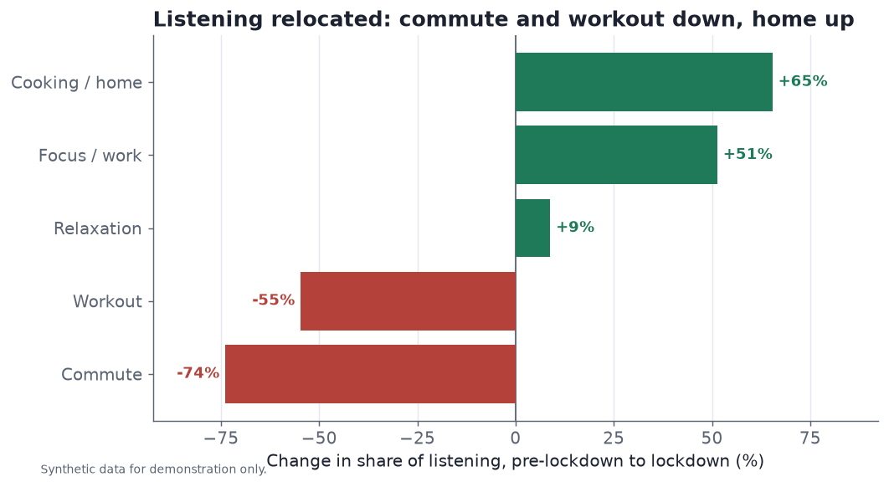

**Data behind this chart.** Each bar is the percent change in a listening
context's share of streams from the pre-lockdown period to the lockdown period.
The inputs are the five context fields (`ctx_commute`, `ctx_workout`,
`ctx_focus_work`, `ctx_relaxation`, `ctx_cooking_home`), daily shares that sum to
1 across contexts. For each context we average the daily share within each
period, then report the lockdown mean minus the pre mean, divided by the pre
mean. In reality context is inferred per session from time of day, day of week,
device, motion or activity signals, and playlist or session type. See the data
dictionary for what each context means.

### 3. The break was abrupt, not gradual

A regression discontinuity in time confirms an immediate level break at the
lockdown cutoff (commute share: about -14 percentage points, p < 0.001), rather
than a slow drift. This is what lets the story be told with confidence.

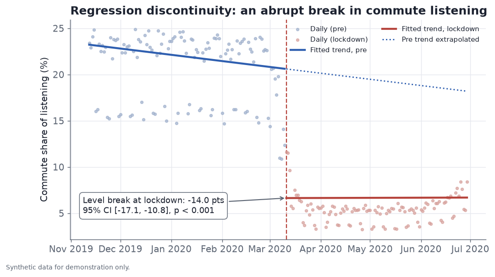

**Data behind this chart.** Points are the daily commute share of streams (the
`ctx_commute` field, in percent) in a window from 120 days before to 111 days
after the March 11, 2020 cutoff. The lines come from an interrupted-time-series
fit: commute share modeled on a time trend, a post-cutoff indicator, a
post-cutoff change in slope, and weekday controls, with Newey-West standard
errors for day-to-day autocorrelation. The blue line is the pre-cutoff trend, the
dotted line extends it as a no-lockdown counterfactual, and the red line is the
fitted lockdown trend. The labeled jump is the coefficient on the post-cutoff
indicator.

### 4. The car gave way to the smart speaker and the desktop

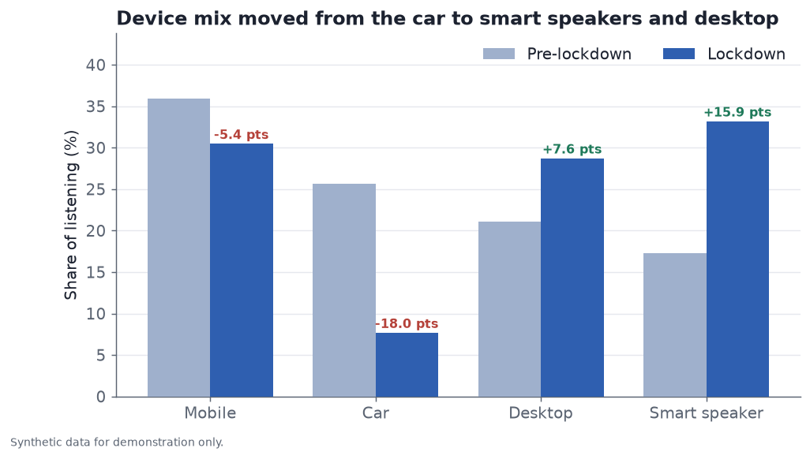

**Data behind this chart.** Each device's share of streams in percent, the
pre-lockdown period mean beside the lockdown period mean, with the point change
labeled. The inputs are the four device fields (`dev_mobile`, `dev_desktop`,
`dev_smart_speaker`, `dev_car`), daily shares that sum to 1 across devices,
averaged within each period. In reality the device type is reported by the client
app or SDK on each stream.

The two devices that carried the story, the car and the smart speaker, each show
the same abrupt break at the cutoff that the commute series does. Car listening
stepped down by 15.9 percentage points of share (95% CI [−19.9, −11.9], p < 0.001)
and smart-speaker listening stepped up by 12.8 percentage points (95% CI
[+10.0, +15.6], p < 0.001).

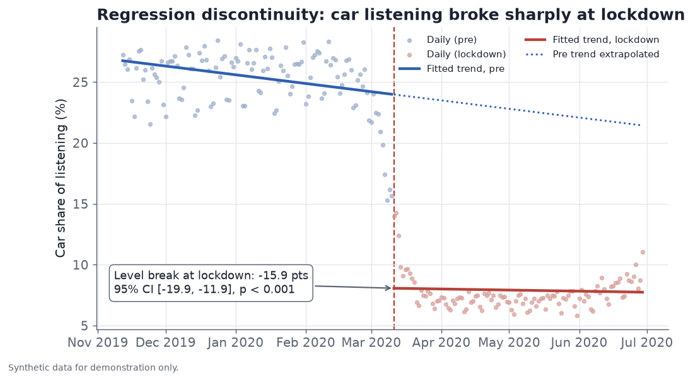

**Data behind this chart.** The interrupted-time-series fit for the car share of
streams (`dev_car`, in percent) in the same 120-day-before to 111-day-after window
as the commute chart. Points are daily shares, the blue line is the pre-cutoff
trend with its dotted no-lockdown extrapolation, and the red line is the fitted
lockdown trend. The labeled jump is the post-cutoff level term with Newey-West
standard errors.

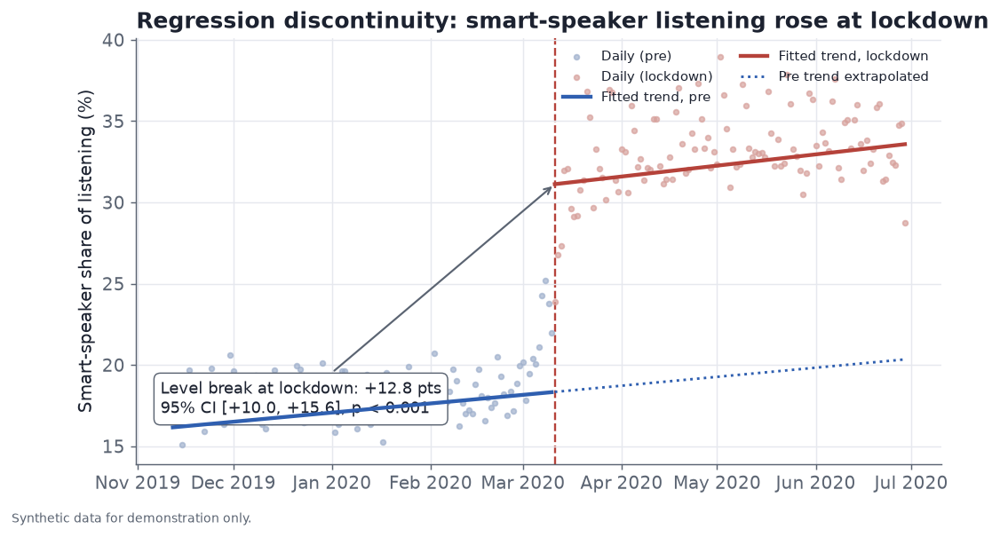

**Data behind this chart.** The same interrupted-time-series fit applied to the
smart-speaker share of streams (`dev_smart_speaker`, in percent). Here the level
term is positive: listening moved onto the home speaker the week lockdowns began
and stayed there, the mirror image of the car decline above.

### 5. The mood cooled: calmer, slower, more somber

Average valence and tempo both dropped at lockdown, then partly recovered.

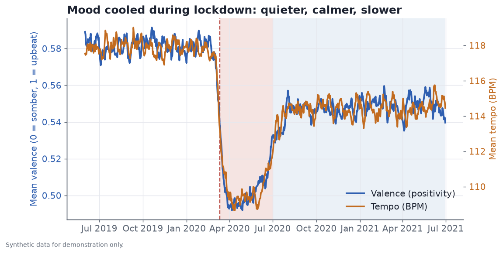

**Data behind this chart.** Two daily metrics, each a 7-day rolling average: mean
valence on a 0 to 1 scale on the left axis (`mean_valence`) and mean tempo in
beats per minute on the right axis (`mean_tempo_bpm`). Valence measures musical
positivity, where values near 0 are somber and values near 1 are upbeat. Each
field is the average across the tracks played that day, weighted by streams. In
reality both come from per-track audio-analysis features joined to each play, then
averaged over the day's listening.

### 6. Listeners reached for familiar catalog over new releases

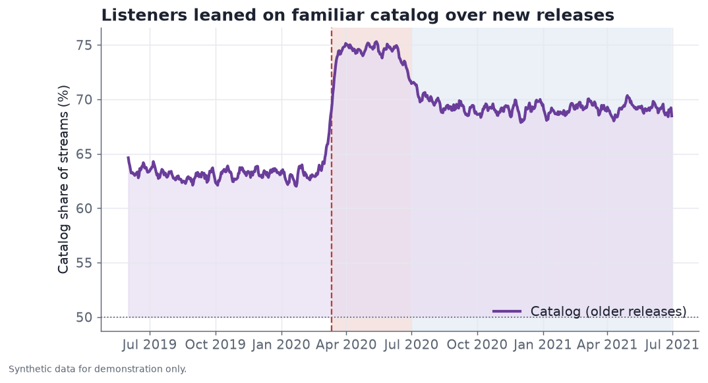

**Data behind this chart.** The catalog share of streams in percent as a 7-day
rolling average (`catalog_share`, with `new_release_share` equal to 1 minus that
value). It is the fraction of daily streams that go to catalog tracks, where
catalog means a track older than 18 months since its release date (the cutoff
defined in the data dictionary). In reality each play is tagged as catalog or new
release by comparing the track's release date to the play date, and the catalog
fraction of daily plays is taken.

### 7. Did the genre change? Ambient and classical rose, dance fell

Yes, and in the direction the rest of the story predicts. Comparing pre-lockdown
against lockdown period means, ambient and lo-fi rose the most, from a 10.1% share
of streams to 18.2%, about +80%. Classical rose from 9.6% to 13.5%, about +41%.
Country was roughly flat at +2%. On the other side, electronic and dance fell the
hardest, from 12.2% to 6.9%, about −44%. Latin fell −19%, hip-hop and R&B fell
−16%, pop fell −11%, and rock was close to flat at −3%.

The regression discontinuity confirms the biggest movers as sharp breaks at the
March 11, 2020 cutoff, not slow drifts. Ambient and lo-fi jumped +7.4 percentage
points of share (95% CI [+5.8, +9.1], p < 0.001), classical jumped +3.7 points
(95% CI [+2.7, +4.7], p < 0.001), and electronic and dance dropped −5.0 points
(95% CI [−6.3, −3.7], p < 0.001). Rock (p = 0.340) and country (p = 0.177) showed
no break distinguishable from zero, matching their near-flat before-and-after
change.

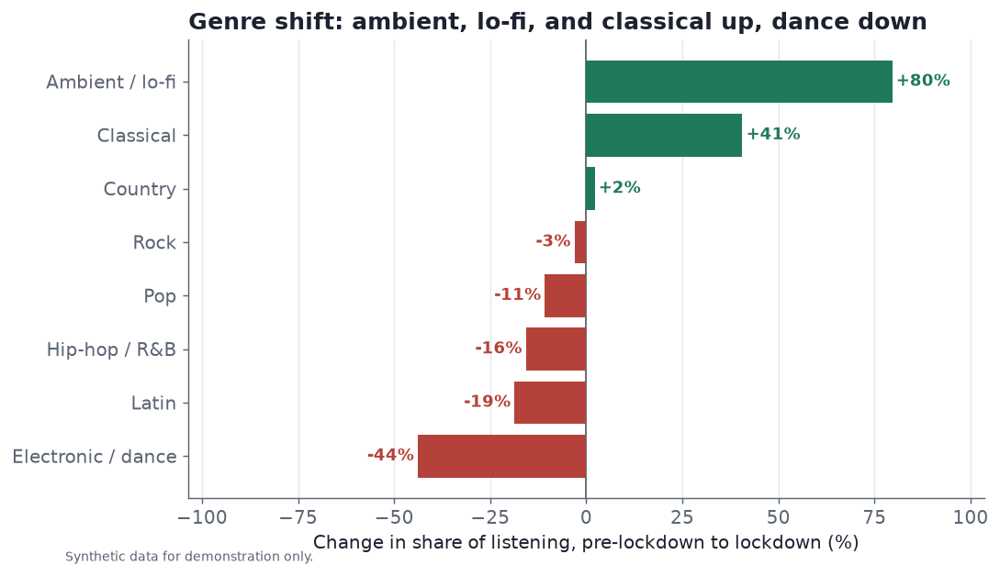

**Data behind this chart.** Each bar is the percent change in a genre's share of
streams from the pre-lockdown period to the lockdown period, sorted from the
largest decline to the largest rise, with a zero baseline. The inputs are the
eight genre fields in `genre_shares.csv` (`genre_pop`, `genre_hip_hop`,
`genre_rock`, `genre_electronic_dance`, `genre_latin`, `genre_classical`,
`genre_ambient_lofi`, `genre_country`), daily shares that sum to 1 across genres.
For each genre we average the daily share within each period, then report the
lockdown mean minus the pre mean, divided by the pre mean. In reality the genre of
a play comes from the genre tag on the track's metadata.

### All regression discontinuity results

The same interrupted-time-series model runs on every dimension, not just the
headline series. The chart below collects the immediate level break at the
lockdown cutoff for all twenty series, with 95% confidence-interval whiskers and a
labeled zero line. Share metrics are grouped and shown in percentage points, and
the two mood metrics sit in their own small panels because valence and tempo carry
different native units.

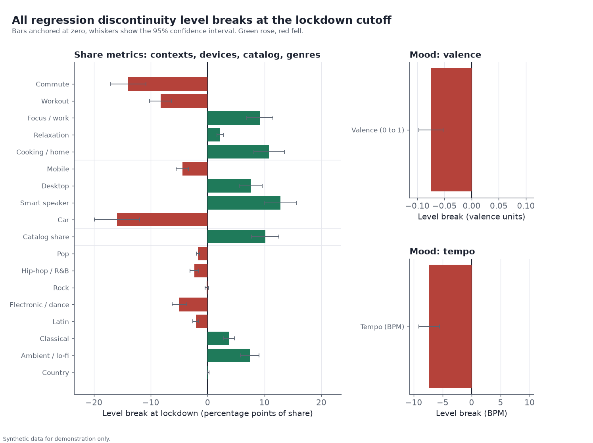

**Data behind this chart.** Every bar is the coefficient on the post-cutoff
indicator (`D`) from the interrupted-time-series fit for one series, using the same
120-day-before to 111-day-after window, weekday controls, and Newey-West standard
errors described above. Bars are anchored at zero, green marks a rise and red a
fall, and each whisker spans the 95% confidence interval of the break. Contexts,
devices, and catalog use the daily tables, and genres use `genre_shares.csv`.

The full table of breaks, with shares expressed in percentage points and the two
mood metrics in their native units, follows. All confidence intervals are 95%.

| Series | Group | Level break | 95% CI | p-value |
| --- | --- | ---: | ---: | ---: |
| Commute | Context | −14.0 pts | [−17.1, −10.8] | < 0.001 |
| Workout | Context | −8.2 pts | [−10.2, −6.3] | < 0.001 |
| Focus / work | Context | +9.2 pts | [+6.9, +11.5] | < 0.001 |
| Relaxation | Context | +2.2 pts | [+1.6, +2.7] | < 0.001 |
| Cooking / home | Context | +10.8 pts | [+8.1, +13.5] | < 0.001 |
| Mobile | Device | −4.5 pts | [−5.5, −3.4] | < 0.001 |
| Desktop | Device | +7.6 pts | [+5.6, +9.6] | < 0.001 |
| Smart speaker | Device | +12.8 pts | [+10.0, +15.6] | < 0.001 |
| Car | Device | −15.9 pts | [−19.9, −11.9] | < 0.001 |
| Catalog share | Catalog | +10.1 pts | [+7.7, +12.6] | < 0.001 |
| Valence | Mood | −0.075 | [−0.097, −0.053] | < 0.001 |
| Tempo | Mood | −7.3 BPM | [−9.1, −5.5] | < 0.001 |
| Pop | Genre | −1.7 pts | [−2.0, −1.4] | < 0.001 |
| Hip-hop / R&B | Genre | −2.4 pts | [−3.1, −1.6] | < 0.001 |
| Rock | Genre | −0.1 pts | [−0.4, +0.2] | 0.340 |
| Electronic / dance | Genre | −5.0 pts | [−6.3, −3.7] | < 0.001 |
| Latin | Genre | −2.1 pts | [−2.6, −1.5] | < 0.001 |
| Classical | Genre | +3.7 pts | [+2.7, +4.7] | < 0.001 |
| Ambient / lo-fi | Genre | +7.4 pts | [+5.8, +9.1] | < 0.001 |
| Country | Genre | +0.1 pts | [−0.0, +0.3] | 0.177 |

Values are rounded for display. Shares are in percentage points of that
dimension's daily share, valence is in its native 0 to 1 units, and tempo is in
beats per minute.

**Read the full narrative:** [outputs/press_report.md](outputs/press_report.md).

---

## Data dictionary

Every field is synthetic and generated from a fixed seed.
Each entry states what the term means, how the synthetic value is constructed, and
what real-world signal it stands in for. Where a dimension is expressed as shares,
the shares sum to 1 within that dimension on each day. The committed CSVs are
`data/listening_daily.csv` (the master daily table), `data/genre_shares.csv`, and
`data/region_daily.csv`.

**Total streams.** Field `total_streams_millions`. The daily count of completed
plays across the catalog, in millions. Synthetic construction: a base level with a
gentle upward trend, a weekend lift, a modest lockdown bump, and daily noise.
Real-world source: aggregated play-event logs from the streaming and distribution
platforms.

**Listening context.** Fields `ctx_commute`, `ctx_workout`, `ctx_focus_work`,
`ctx_relaxation`, `ctx_cooking_home`. The share of a day's streams that happen in
each context. Meanings:

- Commute: listening while traveling to or from work or school, usually on weekday
  mornings and evenings.
- Workout: listening during exercise.
- Focus or work: listening while working or studying, often instrumental or
  low-distraction.
- Relaxation: unwinding, calm or background listening.
- Cooking or home: listening during chores and time spent at home.

Synthetic construction: daily context shares drawn from a softmax over
context-specific baselines, with weekly seasonality, a lockdown level break, and a
partial reopening reversion. Real-world source: context is inferred per session
from time of day, day of week, device, motion or activity signals from the phone,
and playlist or session type. No single raw field carries it, so it is a modeled
label rather than a logged value.

**Device.** Fields `dev_mobile`, `dev_desktop`, `dev_smart_speaker`, `dev_car`.
The share of a day's streams on each device type. Categories: mobile (phone or
tablet app), desktop (computer app or web player), smart speaker (a
voice-controlled home speaker), and car (an in-vehicle app or dashboard
integration). Synthetic construction: daily shares from a softmax with a rising
smart-speaker trend and a lockdown break that moves listening off the car.
Real-world source: the device type reported by the client app or SDK on each
stream.

**Familiar catalog versus new release.** Fields `catalog_share` and
`new_release_share`, which sum to 1. Cutoff definition: a track counts as a new
release for the first 18 months after its release date, and as catalog after that.
The 18-month mark is a common industry definition of catalog. The age of a track
is known from the release date in its metadata, compared to the date of each play.
Familiar catalog means older, established music that a listener is more likely to
already know, which is why a rise in catalog share reads as a move toward comfort
and familiarity. Synthetic construction: a daily catalog share modeled directly
with a lockdown break and partial reversion, rather than built up from per-track
release dates. Real-world source: tag each play as catalog or new release using
the release-date age at play time, then take the catalog fraction of daily plays.

**Mood: valence and tempo.** Fields `mean_valence` and `mean_tempo_bpm`. Valence
is a 0 to 1 measure of musical positivity, where values near 0 are somber or
downbeat and values near 1 are cheerful or upbeat. Tempo is the speed of the music
in beats per minute. Each field is the average across the tracks played that day,
weighted by streams. Synthetic construction: daily means modeled with a lockdown
dip and partial recovery plus noise. Real-world source: per-track audio-analysis
features (valence and tempo computed from the audio) joined to plays and averaged
over the day.

**Genre.** File `genre_shares.csv`, fields prefixed `genre_` (for example
`genre_pop`, `genre_electronic_dance`, `genre_ambient_lofi`). The share of a day's
streams in each genre, summing to 1. Synthetic construction: daily shares from a
softmax with a lockdown break that lifts ambient, lo-fi, and classical and lowers
electronic and dance. Real-world source: the genre tag on each track's metadata.

**Region and the region split.** File `region_daily.csv`, field `region` with
values north_america, europe, latin_america, and asia_pacific, plus
`total_streams_millions`, `commute_share`, and `home_share` for each region and
day. To keep the regional view simple, this table splits listening two ways,
commute versus home, where `commute_share` and `home_share` sum to 1. It does not
use the five-way context breakdown, so the regional commute baseline is not
directly comparable to the commute share in the context data. Synthetic
construction: each region has its own commute baseline, lockdown drop, reopening
pace, and market size. Real-world source: region is taken from the account country
or from IP geolocation, and the commute-versus-home split follows the same context
inference described above.

**Periods and cutoffs.** Field `period` with values pre_lockdown, lockdown, and
reopening. Pre-lockdown runs up to the WHO pandemic declaration on 2020-03-11,
lockdown runs to 2020-07-01, and reopening runs to the end of the window on
2021-06-30. These cutoffs define the before and after windows for every
comparison.

## Methods and limitations

The analysis is deliberately simple and legible for a communications audience:
period-mean before/after comparisons plus a regression discontinuity in time
(interrupted time series) with a level term, pre and post trends, weekday
controls, and Newey-West standard errors.

**Because the data is synthetic, the specific magnitudes are illustrative, not
factual.** A regression discontinuity in time attributes the break to the cutoff
date and, with a single global shock, cannot fully separate lockdown from other
events in the same week. The findings are constructed to be plausible and
internally consistent for demonstration, not to represent real streaming volumes.

## What a production version would add

- Real, privacy-compliant consumption data in place of the synthetic panel, with
  a proper release-window definition of catalog versus new release.
- Placebo cutoffs and a set of pre-registered robustness checks to stress-test the
  discontinuity, plus seasonality controls tuned per market.
- A hierarchical model to pool the region-level estimates (so regional error bars
  reconcile with the global number) rather than analyzing each region separately.
- Automated refresh, alerting on new inflection points, and a reviewed data
  contract feeding the PR and executive reporting workflow.

## Automating the change-point detection (future work)

This study hardcodes the break date at the WHO pandemic declaration, March 11,
2020, because we already knew when the shock landed. The more valuable and more
general version does not assume the date: it discovers the break, or breaks, from
the data itself, and then keeps watching for the next one. That turns a one-off
retrospective into a monitor that flags future inflection points on its own.

Several well-established methods would do this, and they trade off differently.
Offline segmentation methods scan the whole series at once. PELT (pruned exact
linear time) and binary segmentation find the change points that best explain
shifts in the mean or variance under a penalized cost, and Bai-Perron multiple
structural-break tests estimate the number and location of breaks in a regression
relationship with formal confidence intervals, which fits the interrupted-time-
series framing here directly. A scanning Chow test is the simplest cousin: slide a
candidate break date across the window and test each split for a structural change,
taking the strongest as the estimate. Online and streaming methods instead update
as each new day arrives. Bayesian online change-point detection maintains a
posterior over the time since the last break and raises the alarm when that
posterior collapses onto a fresh regime, and CUSUM monitoring accumulates deviations
from the running mean and triggers when the cumulative sum crosses a control limit.
A softer, model-embedded option is to let the trend carry automatic change-point
priors, as Prophet does by placing a sparse Laplace prior on many candidate
change points and letting the fit decide which ones survive.

The tradeoffs are what make this senior-level work rather than a library call.
Scanning many candidate dates is a multiple-testing problem, so naive p-values
overstate significance and inflate false positives, which calls for corrections or
a penalty tuned to the series length. Every method needs a minimum segment length,
otherwise it will happily fit a break to a single noisy week. The hardest
confounder is seasonality: a real regime change has to be told apart from an annual
cycle or a holiday dip, so the detector has to model or remove seasonality first,
or it will keep rediscovering the same December every year. And an online monitor
must balance detection speed against stability, since a tight threshold catches
shifts sooner but fires on noise, while a loose one is calm but slow. Done well,
the payoff is that the same discontinuity estimate reported here would be produced
automatically, dated by the data, and refreshed as new listening comes in, so the
next commute-scale shift surfaces without anyone knowing in advance to look for it.

